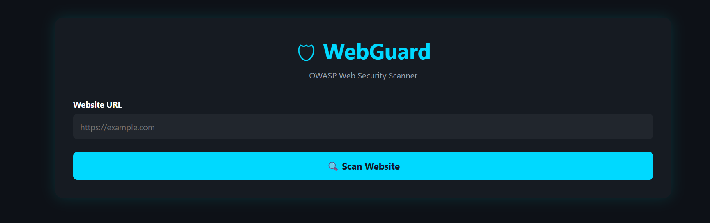
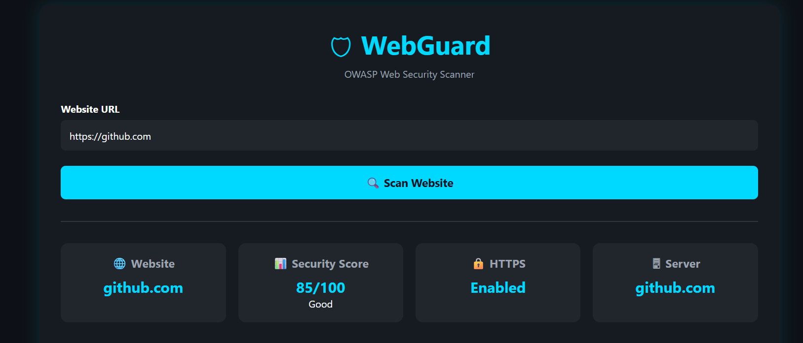
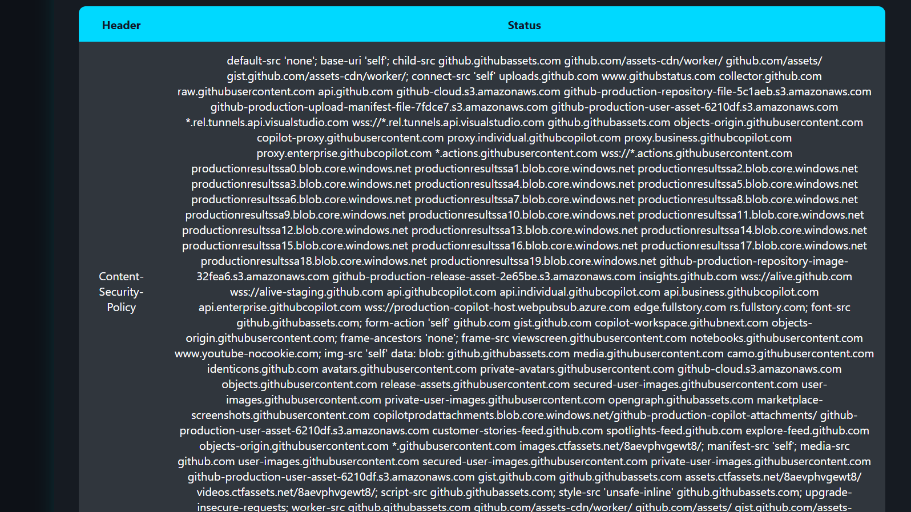
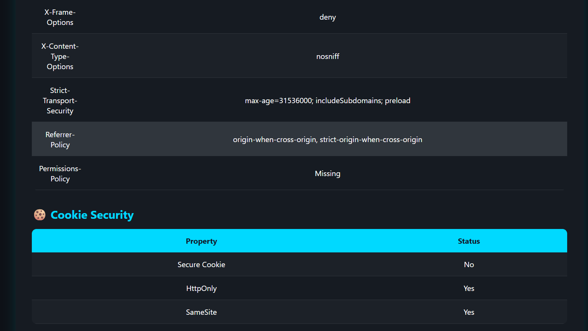
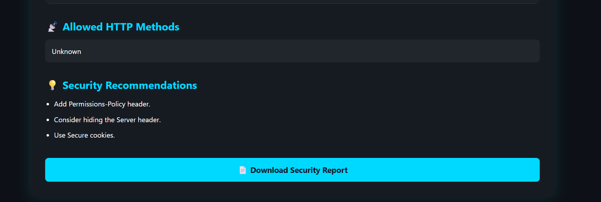

# 🛡️ WebGuard

## OWASP Web Security Scanner

WebGuard is a Flask-based web security assessment tool that analyzes websites against OWASP security best practices. It inspects HTTP security headers, HTTPS usage, cookie security, server information, and provides a security score with actionable recommendations.

---

## ✨ Features

- 🌐 Website Security Scanner
- 🔒 HTTPS Detection
- 🛡️ HTTP Security Header Analysis
- 🍪 Cookie Security Checks
- 🖥️ Server Information Detection
- 📡 HTTP Methods Detection
- 📊 Security Score
- 💡 Security Recommendations
- 📄 Download Security Report
- 🌙 Responsive Dashboard

---

## 🛠 Technologies

- Python
- Flask
- Requests
- BeautifulSoup4
- HTML5
- CSS3
- JavaScript
- Git
- GitHub

---

## 📂 Project Structure

```text
WebGuard/

│── app.py
│── scanner.py
│── report.py
│── requirements.txt
│── README.md

├── templates/
│   └── index.html

├── static/
│   ├── style.css
│   └── script.js

├── reports/

├── screenshots/

└── venv/
```

---

## ⚙️ Installation

```bash
git clone https://github.com/simranjeet-kour/WebGuard.git
```

```bash
cd WebGuard
```

```bash
pip install -r requirements.txt
```

```bash
py app.py
```

Open

```
http://127.0.0.1:5000
```

---

# 📷 Screenshots

## 🏠 Home



---

## 🔍 Website Scan



---

## 🛡️ Security Headers



---

## 💡 Recommendations



---

## 📄 Security Report



---

# 📊 Security Checks

- HTTPS
- Content-Security-Policy
- X-Frame-Options
- X-Content-Type-Options
- HSTS
- Referrer-Policy
- Permissions-Policy
- Secure Cookies
- HttpOnly Cookies
- SameSite Cookies
- HTTP Methods
- Server Information

---

# 🚀 Future Enhancements

- PDF Reports
- SSL Certificate Analysis
- OWASP Top 10 Mapping
- Multi-site Scanning
- Dashboard Charts
- User Authentication
- Scan History

---

# 👩‍💻 Author

**Simranjeet Kour**

Cybersecurity Student

Lovely Professional University

GitHub:
https://github.com/simranjeet-kour

---

⭐ If you found this project useful, consider giving it a star!
